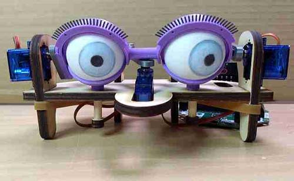

# Mechanical Eyes with the BBC Microbit

Resources for the mechanical eyes workshop.  Uses a BBC microbit to control the movement of 3 servo motors.

Motor control is either using the Adafruit Crickit board or the Kitronik robotics board.

## microbit
Code for the microbit.

**accelerometer-controller-11.hex** 
Code for the remote control, using radio group 11

**microbit-eyes-reset-to-90-crickit.hex** 
Utility to reset all motors to 90 degrees.  Version for Crickit board.

**microbit-eyes-soln-crickit.hex** 
Solution for the Crickit version.

**microbit-eyes-soln-crickit-b-to90degrees.hex** 
Solution for the Crickit version, which additionally uses button B to reset the motor positions.

**microbit-eyes-soln-kitronik.hex** 
Solution for the Kitronik version.

## designs
2D and 3D designs

---
Please go to [www.thinkcreatelearn.co.uk](www.thinkcreatelearn.co.uk) for more details.
